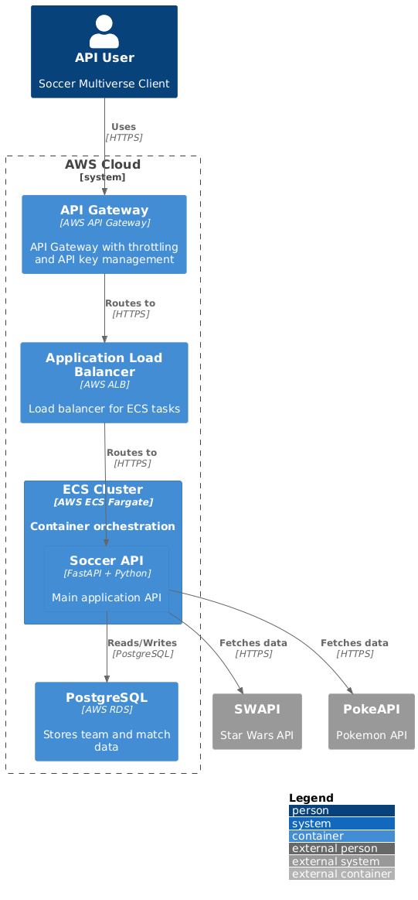

This is an experimental project in clean architecture.

It's a simple API that generates a team of players for a given universe.

### Outline

# Project Structure

## Domain Layer (/src/domain/)
- Models:
  - Player (base class)
  - Team
  - Universe (enum: STAR_WARS, POKEMON)
  - Position (enum: GOALIE, DEFENCE, OFFENSE)
- Interfaces:
  - PlayerRepository
  - UniverseRepository

## Infrastructure Layer (/src/infrastructure/)
- External API Clients:
  - SWAPIClient
  - PokeAPIClient
- Repositories (database):
  - PlayerRepository
  - UniverseRepository

## API Layer (/src/api/)
- REST Controllers:
  - TeamController
- DTOs:
  - TeamDTO
  - PlayerDTO

## Tests
- Unit Tests (/tests/unit/):
  - Domain models
  - Services
  - Repository implementations
- Integration Tests (/tests/integration/):
  - WIP


## Running the project


```bash
brew install uv
docker compose up -d # postgres
uv run uvicorn src.main:app --reload
```

## Testing

```bash
uv run pytest
```

## Available Endpoints

http://localhost:8000/api/v1/universes
http://localhost:8000/api/v1/teams/generate/Pokemon
http://localhost:8000/api/v1/teams/generate/Pokemon?defenders=4&attackers=0
http://localhost:8000/api/v1/teams/generate/Star%20Wars


## Deployment Diagram 


